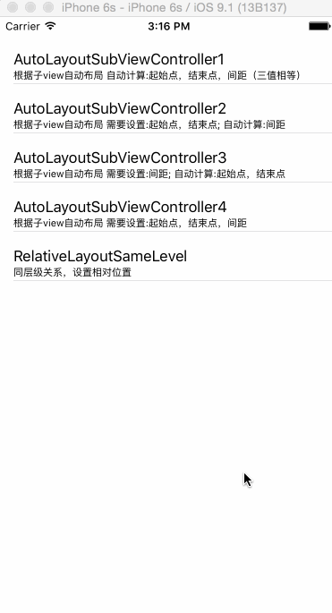

# README

# BearSkill

[](https://travis-ci.org/Bear/BearSkill)
[](http://cocoapods.org/pods/BearSkill)
[](http://cocoapods.org/pods/BearSkill)
[](http://cocoapods.org/pods/BearSkill)

## Usage

To run the example project, clone the repo, and run `pod install` from the Example directory first.

## Requirements

## Installation

BearSkill is available through [CocoaPods](http://cocoapods.org). To install
it, simply add the following line to your Podfile:

```ruby
pod "BearSkill"
```

## Author

Bear, 648070256@qq.com

## License

BearSkill is available under the MIT license. See the LICENSE file for more info.

Introduction
------------

BearSkill纯代码搭建iOS界面
本文原文地址: http://blog.csdn.net/xiongbaoxr/article/details/50668260
-------------------

浅谈一下
----

关于iOS兼容布局一直都是开发者经常面对的问题，随着代码量的增加，很多人也有了一套自己的布局理论。本人也做了不少项目，开始用的Storyboard，xib，约束布局。因为是做的大多是应用型App，对于横竖屏的切换不是很多，所以约束的优点我们用的很少。 

随着项目变的越来越大，每次需求变动改动或者复用界面时都会有无必要的触碰到之前设置好的约束，结果很容易导致约束crash，布局乱的一塌糊涂，找了半天也不一定能完美解决反而经常浪费了不少时间。 

后来就开始基于约束布局的理念，自己整理了一套布局方式。并且整理了一些常用的布局方法，上传到自己的Pod里面。Pods里面还有一些其他方法，本文暂不讨论，只说布局这一块。

演示Demo下载地址：https://github.com/BearRan/BearSkillDemo 

注：关于布局的方法都在UIView+BearSet中

### 多个子类view布局方法

项目中经常会有多个子类view按照某个方向等间距布局这种情况。针对这种情况，特有如下四种方法。一切尽在gif和demo中，大家自己理解下。demo的界面上也有方法名称和适用场景说明。

 // 根据子view自动布局 自动计算:起始点，结束点，间距（三值相等）

 // 说明： 在父类view尺寸不等于需求尺寸时，会显示日志并且取消布局

`+ (void)BearAutoLayViewArray:(NSMutableArray \*)viewArray layoutAxis:(kLAYOUT\_AXIS)layoutAxis center:(BOOL)center;`


`​`/\*\* \* 根据子view自动布局 需要设置:起始点，结束点; 自动计算:间距 \* 说明： 在父类view尺寸不等于需求尺寸时，会显示日志并且取消布局 \*/ 
+ (void)BearAutoLayViewArray:(NSMutableArray \*)viewArray layoutAxis:(kLAYOUT\_AXIS)layoutAxis center:(BOOL)center offStart:(CGFloat)offStart offEnd:(CGFloat)offEnd;



`​`/\*\* \* 根据子view自动布局 需要设置:间距; 自动计算:起始点，结束点 \* 说明： 在父类view尺寸不等于需求尺寸时，会显示日志并且取消布局 \*/ 
+ (void)BearAutoLayViewArray:(NSMutableArray \*)viewArray layoutAxis:(kLAYOUT\_AXIS)layoutAxis center:(BOOL)center gapDistance:(CGFloat)gapDistance;


`​`/\*\* \* 根据子view自动布局 需要设置:起始点，结束点，间距 \* 说明： 在父类view尺寸不等于需求尺寸时，会自动变化 \*/ 
+ (void)BearAutoLayViewArray:(NSMutableArray \*)viewArray layoutAxis:(kLAYOUT\_AXIS)layoutAxis center:(BOOL)center offStart:(CGFloat)offStart offEnd:(CGFloat)offEnd gapDistance:(CGFloat)gapDistance;


View与View之间的相对布局
----------------

在同一图层或者父子类的关系的view中，view之间的位置关系也是我们经常需要设置的，来看demo 


如果还是不太清楚怎么使用，每个代码的最后都有最简使用代码示例 


常用的其他布局参数Set和Get
----------------

不一一解释了，都是看了名字就知道的参数

// Getter

 - - (CGFloat)x; 
 - - (CGFloat)y; 
 - - (CGFloat)maxX; 
 - - (CGFloat)maxY;
 - - (CGFloat)width; 
 - - (CGFloat)height; 
 - - (CGPoint)origin;
 - - (CGSize)size;  
 - - (CGFloat)centerX; 
 - - (CGFloat)centerY;  
 
//Setter 
- - (void)setX:(CGFloat)x; 
- - (void)setMaxX:(CGFloat)maxX; 
- - (void)setMaxX\_DontMoveMinX:(CGFloat)maxX;  
- - (void)setY:(CGFloat)y; 
- - (void)setMaxY:(CGFloat)maxY; 
- - (void)setMaxY\_DontMoveMinY:(CGFloat)maxY;  
- - (void)setWidth:(CGFloat)width; 
- - (void)setHeight:(CGFloat)height; 
- - (void)setOrigin:(CGPoint)point; 
- - (void)setOrigin:(CGPoint)point sizeToFit:(BOOL)sizeToFit; 
- - (void)setSize:(CGSize)size;  
- - (void)setCenterX:(CGFloat)x; 
- - (void)setCenterY:(CGFloat)y;  
- - (void)setWidth\_DonotMoveCenter:(CGFloat)width; 
- - (void)setHeight\_DonotMoveCenter:(CGFloat)height;
- - (void)setSize\_DonotMoveCenter:(CGSize)size; 
- - (void)sizeToFit\_DonotMoveSide:(kDIRECTION)dir centerRemain:(BOOL)centerRemain; 

和父类view剧中
当前view和父类view的 X轴／Y轴／中心点 对其
- - (void)BearSetCenterToParentViewWithAxis:(kAXIS)axis; 

和指定的view剧中
当前view和指定view的 X轴／Y轴／中心点 对其
- - (void)BearSetCenterToView:(UIView \*)destinationView withAxis:(kAXIS)axis;
